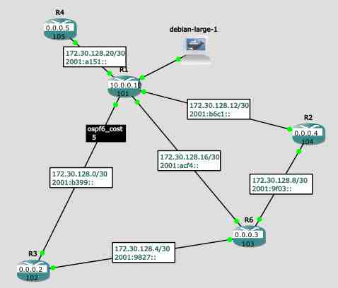

# Autoconfigurateur Cisco IOS
Ce script python se connecte au serveur GNS3 local et configure entièrement 
un réseau OSPF sur tous les routeurs Cisco. Il effectue tout seul l'adressage IP, l'allocation
des ``router-id``... 

Il s'adapte à n'importe quelle topologie réseau, et vous êtes libre de choisir le nom de vos routeurs ! 
Il est possible de personaliser la configuration avec le système de templates et valeurs.
Vous pouvez remplacer tout ce qui est généré par l'autoconfiguration et changer les templates.

Le script génère des configurations Cisco et peut les applique tout seul aux routeurs via la 
console telnet GNS3

# Fonctionnalités
## Autoconfiguration
Ce script récupère la topologie de votre réseau et crée tout seul un plan d'allocation d'adresses IP
pour les liens entre routeurs. Il alloue les Router-ID et ASN.

## Templates dynamiques
Des templates extensibles et dynamique mélangent les données d'autoconfiguration avec 
la configuration utilisateur pour générer une configuration Cisco IOS.

Les templates de base déploien un réseau OSPF/BGP/mpls d'exemple.

Chaque élément (**routeur**, **interface**, **lien**) peut définir des **valeurs** et des **templates** qui seront
mixés dans la configuration finale.
Cela permet une organisation flexible et puissante.
## Abstractions
Les **classes** vous permettent de changer la configuration des différents routeurs sans
dupliquer les éléments de configuration.
Une classe peut référencer d'autres classes
de manière récursive, ce qui vous permet de définir des groupes de routeurs et des morceaux de configurations
que l'on peut ou pas ajouter.

Vous pourriez par exemple avoir une classe qui configure le coût d'un lien OSPF et ensuite
définir sur chaque interface de chaque routeur le coût choisi. Mais vous pouvez également faire une 
nouvelle classe qui définit la valeur du coût et appliquer cette classe à plusieurs interfaces ou même
à toutes les interfaces d'un routeur.
## Multi-shell
Avec ``python3 main.py -g ``, vous pouvez exécuter une commande sur tous les routeurs Cisco !


# Installation
```
pip3 install gns3fy==0.7.1 Jinja2==2.11.2
```
* créez un nouveau projet vide dans GNS3
* allez dans *Edit > Preferences > Server > Main Server*
* décochez `protect server with password`
* faites *Ok*

# Utilisation
* Ouvrez votre projet
* Lancez votre projet (si c'est déjà pas besoin de relancer)
* Attendez que les routeurs démarrent
* Lancez le script
* Attendez que les routeurs se découvrent et propagent leurs routes
Et vous avez votre réseau OSPF, BGP, mpls sans effort !

```
usage: main.py [-h] [--gen-skeleton] [--hide-labels] [--delete-labels] [--apply] [--show-topology] [--global-cmd [GLOBAL_CMD ...]]

Configurateur automatique de routeurs dans GNS3

optional arguments:
  -h, --help            show this help message and exit
  --gen-skeleton        Affiche un squelette de configuration adapté au réseau détécté, sans configurer les routeurs.
  --hide-labels         Crée des jolis labels dans GNS3 pour afficher les subnets, router-id et ASN
  --delete-labels       Efface tous les labels crées par ce programme de GNS3 puis termine.
  --apply               Active l'envoi automatique des configurations aux routeurs
  --show-topology       Montre la topologie détéctée par ce script.
  --global-cmd [GLOBAL_CMD ...], -g [GLOBAL_CMD ...]
                        Une commande qui sera exécutée sur tous les routeurs en même temps. Pas besoin de mettre de guillements :)

```
## Personaliser des parties de la configuration
Le fichier `config.py` vous permet de rajouter votre grain de sel. Regardez les configurations générées
et les données JSON pour savoir comment modifier les templates.

Le langage de template utilisé est *Jinja2*, qui a la même syntaxe que les templates *Django*.
Attention, pour faire le rendu d'un template dans un autre, il faut faire comme suit:
```jinja2
{{Template(child.template).render(Template=Template,parent=parent,child=child)}}
```
Il faut passer la classe ``Template`` en variable pour que les templates enfants puissent marcher.
La configuration d'exemple fait cela pour les *interfaces* et les *classes*.

Pour trouver les noms des interfaces, activez *View > Show/Hide interfaces labels*

### Comment debug
Le script place les configurations qu'il a générées dans un sous-dossier ``output`` du dossier courant.
Vous trouverez dedans la configuration Cisco mais aussi un fichier *json* qui contient toutes les données utilisées
pour générer la configuration. Ça peut vous être utile pour personaliser les templates.

## Problèmes
L'allocation des **ASN**, des **router-id** et des **subnets IPv4** n'est pas déterministe et peut changer entre
si vous rajoutez des routeurs. Je vous recommande donc de ne pas faire de ``write`` sur les routeurs
et de les redémarrer quand vous rajoutez/enlevez des routeurs.

Sinon il est aussi possible de rajouter une 'anti-configuration' qui désactive tout juste avant la nouvelle configuration. 

## Limitations
* Les templates par défaut ne font rien des clés `'disable'`, mais vKous pouvez en choisir le fonctionnement
avec ``...``.
* Si vous modifiez les adresses IPv4, le diagramme dans GNS3 ne reflètera pas vos modifications.
* le script efface les sauts de lignes superflus pour réduire la taille des confs Cisco
pour avoir un saut de ligne (ligne vide), soit vous changez le fonctionnement soit vous faites
comme Cisco dans ``show running-config``, mettez un point d'exclamation `!` sur la ligne.
## Diagramme dans GNS3
Ce script crée automatiquement des petites étiquettes/dessins dans GNS3 pour afficher le
sous-réseau actif sur un lien (IPv4 et IPv6).
Il affiche aussi le router-id par dessus l'icône du routeur.
### Je peux pas bouger les dessins
C'est normal, ils sont verrouillées pour que le script les retrouve et puisse les supprimer.
Si vous voulez tous les enlever, rajoutez ``exit(0)`` après `delete_drawings(project)` (ligne 196 `main.py`). Pour les bouger il suffit de faire clic droit > *Unlock item*.

Mais si vous faites ça il faudra les supprimer à la main.

### J'arrive plus à cliquer sur les routeurs pour accéder à la console !
Utilisez le bouton *Control > Console connect to all nodes*

Si c'est trop agaçant vous pouvez relancer le programme avec ``--delete-labels`` pour effacer les dessins.


## TODO
 * [ ] pouvoir tagger les routeurs & interfaces en groupes
 * [x] faire en sorte que l'utilisateur fournisse les templates (jinja2 ? pug ?)
 * [x] pouvoir assigner des coûts aux liens pour du Traffic engineering (et les afficher avec des dessins GNS3)
 * [ ] configurer les conteneurs Docker
 * [ ] avoir un GUI ? (mdr)
 * [x] option pour générer juste un squelette des configs ?
 * [x] générer des adresses IPv4 qui font des réseaux en /30 pour être + économe
 * [ ] séparer le réseau et l'adresse dans le JSON pour pouvoir configurer facilement BGP

----
> est-ce que j'ai gagné du temps en automatisant mon travail ? c'est pas sûr
### Crédits
 * Le package [gns3fy](https://github.com/davidban77/gns3fy) de David Flores
 * Helm pour l'inspiration des templates/values
# Format de données

Les données de configuration apparaissent dans le dossier `ouput` au format JSON.
La configuration utilisateur est définie dans la (grosse) variable ``custom_config`` du fichier ``config.py.``

La commande ``python3 main.py --gen-skeleton`` vous crée un squelette vide de configuration personalisée
que vous pouvez remplir là où vous en avez besoin.

## configuration utilisateur
```python
custom_config = {
    'templates': {
        'router': "",
        'interface': "",
    },
    'default_router_classes': [],
    'default_interface_classes': [],
    'classes': [{
        'name': "<default>",
        'type': "<router|interface>",
        'template': "",
        'values': {
            'a': 'b',
        }
    }],
    'links': [

        {
            'name': "",
            'interface_classes': [],
            'router_classes': [],
            'template': "",
            'interface_values': {},
        }],
    'routers': { # notez que c'est bien un dict() et pas une liste !
        {
            'disable': False,
            'classes': [],
            'template': "",
            'interfaces': { # c'est toujours pas une liste !
                {
                    'template': "",
                    'classes': [],
                    'values': {},
                }
            },
            'values': {},
        }}
}

```

## représentation interne disponible dans les templates
```json
{
    "announce_internal": true,
    "asn": 101,
    "disable": false,
    "interface_classes": [
        "ospf4-interface",
        "ospf6-interface",
        "mpls-interface"
    ],
    "interfaces": [
        {
            "disable": false,
            "interface_template": "# oh que oui {{interface.oui}}",
            "ip_end6": "2",
            "ip_network4": "172.30.128.2 255.255.255.252",
            "ip_network6": "2001:b399",
            "lien": "R3<-->R1",
            "name": "f5/0",
            "ospf6_cost": 5,
            "oui": "oh non",
            "peer": {
                "asn": 102,
                "interface": "f4/0",
                "ip4": "172.30.128.1",
                "ip6": "2001:b399::1",
                "name": "R3"
            },
            "resolved_classes": [
                {
                    "name": "mpls-interface",
                    "template": "mpls ip",
                    "type": "interface"
                },
                {
                    "name": "ospf6-interface",
                    "template": "    ipv6 ospf {{router.ospf_process}} area {{router.ospf_area}}",
                    "type": "interface"
                },
                {
                    "name": "ospf6-cost",
                    "template": "ipv6 ospf cost {{interface.ospf6_cost}}",
                    "type": "interface"
                },
                {
                    "name": "ospf4-interface",
                    "template": "ip ospf {{router.ospf4_process}} area {{router.ospf4_area}}\n    ip address {{interface.ip_network4}}\n            ",
                    "type": "interface"
                }
            ],
            "template": "\ninterface {{interface.name}}\n# cette interface ne doit pas \u00eatre configur\u00e9\n\n    description connectee a {{interface.peer.interface}} de  {{interface.peer.name}}\n\n    no shutdown\n    ipv6 enable\n    ipv6 address {{interface.ip_network6}}::{{interface.ip_end6}}/64\n    \n    {{classe.template}}\n    \n    {{ interface.interface_template }}\n  exit\n# fin interface {{interface.name}}",
            "uid": "2570445c-69f9-4316-b399-3f034077bd04"
        },
        {
            "disable": false,
            "interface_template": "ip address 192.168.0.1 255.255.255.0",
            "ip_end6": "1",
            "ip_network4": "configurez manuellement",
            "ip_network6": "2001:1:1:1",
            "lien": "edge",
            "name": "f1/0",
            "resolved_classes": [],
            "template": "\ninterface {{interface.name}}\n# cette interface ne doit pas \u00eatre configur\u00e9\n\n    description connectee a {{interface.peer.interface}} de  {{interface.peer.name}}\n\n    no shutdown\n    ipv6 enable\n    ipv6 address {{interface.ip_network6}}::{{interface.ip_end6}}/64\n    \n    {{classe.template}}\n    \n    {{ interface.interface_template }}\n  exit\n# fin interface {{interface.name}}"
        },
        {
            "disable": false,
            "interface_template": "",
            "ip_end6": "1",
            "ip_network4": "172.30.128.13 255.255.255.252",
            "ip_network6": "2001:b6c1",
            "lien": "R1<-->R2",
            "name": "f3/0",
            "peer": {
                "asn": 104,
                "interface": "f0/0",
                "ip4": "172.30.128.14",
                "ip6": "2001:b6c1::2",
                "name": "R2"
            },
            "resolved_classes": [
                {
                    "name": "ospf6-interface",
                    "template": "    ipv6 ospf {{router.ospf_process}} area {{router.ospf_area}}",
                    "type": "interface"
                },
                {
                    "name": "mpls-interface",
                    "template": "mpls ip",
                    "type": "interface"
                },
                {
                    "name": "ospf4-interface",
                    "template": "ip ospf {{router.ospf4_process}} area {{router.ospf4_area}}\n    ip address {{interface.ip_network4}}\n            ",
                    "type": "interface"
                }
            ],
            "template": "\ninterface {{interface.name}}\n# cette interface ne doit pas \u00eatre configur\u00e9\n\n    description connectee a {{interface.peer.interface}} de  {{interface.peer.name}}\n\n    no shutdown\n    ipv6 enable\n    ipv6 address {{interface.ip_network6}}::{{interface.ip_end6}}/64\n    \n    {{classe.template}}\n    \n    {{ interface.interface_template }}\n  exit\n# fin interface {{interface.name}}",
            "uid": "dd68b3b3-1f11-4ff9-b6c1-25d38c6dd414"
        },
        {
            "disable": false,
            "interface_template": "",
            "ip_end6": "1",
            "ip_network4": "172.30.128.17 255.255.255.252",
            "ip_network6": "2001:acf4",
            "lien": "R1<-->R6",
            "name": "f4/0",
            "peer": {
                "asn": 103,
                "interface": "f2/0",
                "ip4": "172.30.128.18",
                "ip6": "2001:acf4::2",
                "name": "R6"
            },
            "resolved_classes": [
                {
                    "name": "ospf6-interface",
                    "template": "    ipv6 ospf {{router.ospf_process}} area {{router.ospf_area}}",
                    "type": "interface"
                },
                {
                    "name": "mpls-interface",
                    "template": "mpls ip",
                    "type": "interface"
                },
                {
                    "name": "ospf4-interface",
                    "template": "ip ospf {{router.ospf4_process}} area {{router.ospf4_area}}\n    ip address {{interface.ip_network4}}\n            ",
                    "type": "interface"
                }
            ],
            "template": "\ninterface {{interface.name}}\n# cette interface ne doit pas \u00eatre configur\u00e9\n\n    description connectee a {{interface.peer.interface}} de  {{interface.peer.name}}\n\n    no shutdown\n    ipv6 enable\n    ipv6 address {{interface.ip_network6}}::{{interface.ip_end6}}/64\n    \n    {{classe.template}}\n    \n    {{ interface.interface_template }}\n  exit\n# fin interface {{interface.name}}",
            "uid": "bf788c6f-0c22-4da3-acf4-0849e0eeab3d"
        },
        {
            "disable": false,
            "interface_template": "no ipv6 ospf 1 area 1",
            "ip_end6": "101",
            "ip_network4": "172.30.128.21 255.255.255.252",
            "ip_network6": "2001:a151",
            "lien": "R1<-->R4",
            "name": "f0/0",
            "peer": {
                "asn": 105,
                "interface": "f3/0",
                "ip4": "172.30.128.22",
                "ip6": "2001:a151::2",
                "name": "R4"
            },
            "resolved_classes": [
                {
                    "name": "ospf6-interface",
                    "template": "    ipv6 ospf {{router.ospf_process}} area {{router.ospf_area}}",
                    "type": "interface"
                },
                {
                    "name": "mpls-interface",
                    "template": "mpls ip",
                    "type": "interface"
                },
                {
                    "name": "ospf4-interface",
                    "template": "ip ospf {{router.ospf4_process}} area {{router.ospf4_area}}\n    ip address {{interface.ip_network4}}\n            ",
                    "type": "interface"
                }
            ],
            "template": "\ninterface {{interface.name}}\n# cette interface ne doit pas \u00eatre configur\u00e9\n\n    description connectee a {{interface.peer.interface}} de  {{interface.peer.name}}\n\n    no shutdown\n    ipv6 enable\n    ipv6 address {{interface.ip_network6}}::{{interface.ip_end6}}/64\n    \n    {{classe.template}}\n    \n    {{ interface.interface_template }}\n  exit\n# fin interface {{interface.name}}",
            "uid": "ba76bf13-9e76-4352-a151-79d8e8a27ca3"
        }
    ],
    "name": "R1",
    "ospf4_area": 0,
    "ospf4_process": 2,
    "ospf_area": 0,
    "ospf_process": 1,
    "resolved_classes": [
        {
            "interface_classes": [
                "ospf4-interface"
            ],
            "name": "ospf4-router",
            "template": "router ospf {{router.ospf4_process}}\n            router-id {{router.router_id}}\n            redistribute connected subnets\n            exit",
            "type": "router",
            "values": {
                "ospf4_area": 0,
                "ospf4_process": 2
            }
        },
        {
            "name": "bgp-router",
            "template": "\nrouter bgp {{router.asn}}\nbgp router-id {{router.router_id}}\n\n\nneighbor {{interface.peer.ip4}} remote-as {{interface.peer.asn}}\nneighbor {{interface.peer.ip4}} activate\nneighbor {{interface.peer.ip6}} remote-as {{interface.peer.asn}}\nneighbor {{interface.peer.ip6}} activate\naddress-family ipv4 unicast\n    redistribute connected\nexit-address-family\naddress-family ipv6 unicast\n    redistribute connected\nexit-address-family\n\n\nexit\n            ",
            "type": "router",
            "values": {
                "announce_internal": true
            }
        },
        {
            "interface_classes": [
                "ospf6-interface"
            ],
            "name": "ospf6-router",
            "template": "ipv6 router ospf {{ospf_process}}\n    redistribute connected\n    router-id {{router.router_id}}\n  exit",
            "type": "router",
            "values": {
                "ospf_area": 0,
                "ospf_process": 1
            }
        },
        {
            "interface_classes": [
                "mpls-interface"
            ],
            "name": "mpls-router",
            "template": "ip cef\nipv6 cef",
            "type": "router"
        }
    ],
    "router_id": "10.0.0.10",
    "template": "#### configuration de {{router.name}}\nipv6 unicast-routing\n            \n# rendered_interfaces contient la configuration des interfaces, d\u00e9j\u00e0 g\u00e9n\u00e9r\u00e9e\n\n{{interface}}\n#--\n\n            \n# les templates provenant des classes seront remplac\u00e9s \u00e0 la 2e passe de templating\n\n# classe {{classe.name}}\n{{classe.template}}\n#--\n# fin classe {{classe.name}}\n\n            \n# ce routeur ne doit pas \u00eatre configur\u00e9\n# fin de la configuration de {{router.name}}\n"
}
```